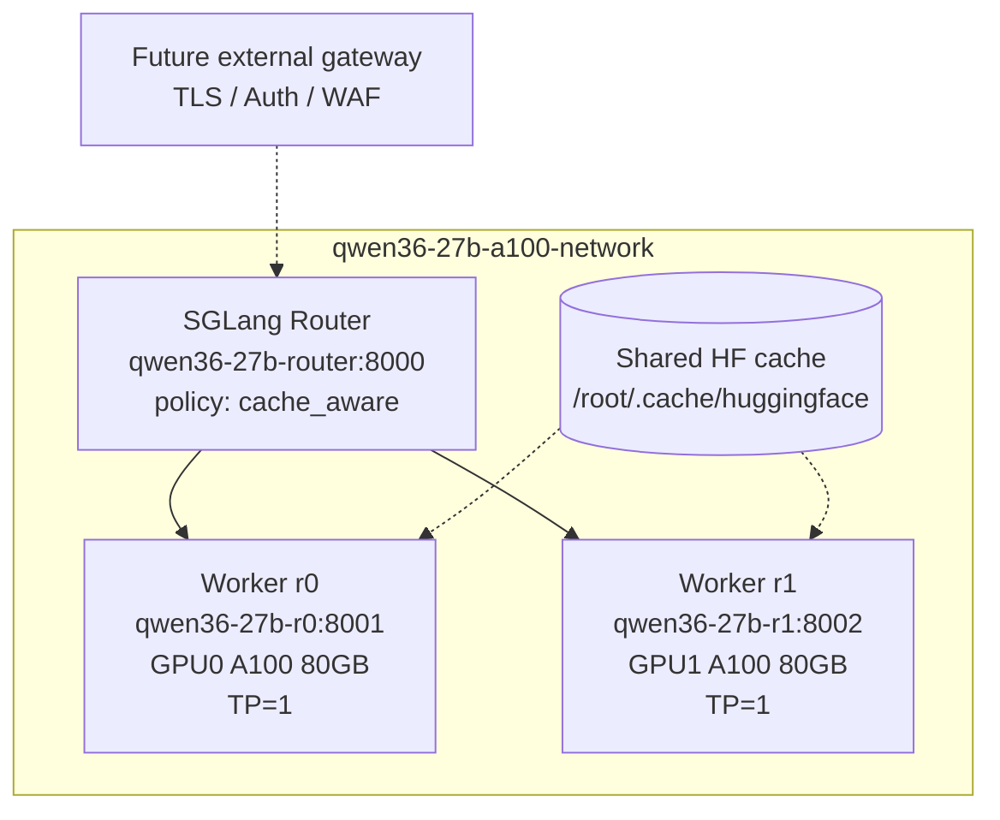

# Qwen3.6-27B SGLang Deployment on 2×A100

This repository contains a private Docker Compose deployment for serving `Qwen/Qwen3.6-27B` with SGLang on a host with two A100 80GB GPUs.

The deployment uses:

- two independent SGLang workers, one per GPU;
- `TP=1` per worker;
- an internal SGLang Router / Model Gateway;
- cache-aware routing;
- NGRAM speculative decoding;
- no host-published ports;
- future gateway integration through the private Docker network.

> Current production recommendation: keep **HiCache disabled** for this model until the upstream Qwen3.5/Qwen3.6 hybrid Mamba/Attention HiCache crash is fixed.

---

## 1. Architecture




### Internal endpoints

```text
qwen36-27b-router:8000   # internal OpenAI-compatible router endpoint
qwen36-27b-r0:8001       # internal worker 0 endpoint
qwen36-27b-r1:8002       # internal worker 1 endpoint
```

### External access model

No Compose service publishes ports to the host. The future external gateway should join the Docker network:

```text
qwen36-27b-a100-network
```

and proxy traffic to:

```text
http://qwen36-27b-router:8000
```

---

## 2. Why two TP=1 replicas instead of one TP=2 server

This deployment intentionally runs two full model replicas:

```text
GPU0 -> qwen36-27b-r0 -> full Qwen3.6-27B instance
GPU1 -> qwen36-27b-r1 -> full Qwen3.6-27B instance
```

This is a simple data-parallel serving design. Each worker owns a full model copy and handles independent requests. The workers do not need to communicate with each other during inference.

This is preferred on this host because GPU peer-to-peer access between the two A100 cards is not available. A TP=2 server would require inter-GPU tensor-parallel communication. With P2P unavailable, that path can become slower and more fragile than two independent replicas.

Operational benefits:

- no runtime all-reduce between GPUs;
- no dependency on GPU P2P;
- better fault isolation;
- simpler worker-level restart;
- router can continue serving if one replica is down, depending on router health behavior;
- aggregate concurrency increases for small multi-user workloads.

---

## 3. Router behavior

The router receives OpenAI-compatible API requests and forwards each request to one worker.

```text
client / future gateway
        |
        v
qwen36-27b-router:8000
        |
        +--> qwen36-27b-r0:8001
        |
        +--> qwen36-27b-r1:8002
```

The router uses:

```bash
--policy cache_aware
```

The purpose of `cache_aware` routing is to preserve prefix-cache locality. Each worker has a separate local cache. A request sent to `r0` cannot reuse cache entries stored on `r1`, and vice versa.

Cache-aware routing tries to send similar-prefix requests to the worker that likely already has matching prefix data cached. This is useful for:

- coding-agent sessions;
- repeated system prompts;
- legal RAG templates;
- multi-turn conversations;
- repeated long-context workflows.

Important limitation:

```text
The router does not merge GPU memory.
```

You do not get one virtual 160GB model server. You get two separate 80GB model servers behind one endpoint.

---

## 4. Current optimization choices

### 4.1 Attention backend

Current setting:

```bash
--attention-backend flashinfer
```

FlashInfer is the preferred attention backend for this CUDA/A100 configuration in this deployment. Do not switch to Hopper/Blackwell-specific attention backends unless the SGLang docs and the current image build explicitly support the change.

### 4.2 CUDA graph decode

Current setting:

```bash
--cuda-graph-max-bs-decode 4
```

This enables CUDA Graph capture for decode batch sizes up to 4, matching:

```bash
--max-running-requests 4
```

The older flag:

```bash
--cuda-graph-max-bs
```

is deprecated in this SGLang build and should not be used.

Expected informational log:

```text
Disable prefill CUDA graph because cuda_graph_config resolved prefill.backend='disabled'
```

This is acceptable as long as decode CUDA graph capture succeeds, for example:

```text
Capture cuda graph bs [1, 2, 3, 4]
Capture cuda graph end.
```

### 4.3 NGRAM speculative decoding

Current settings:

```bash
--speculative-algorithm NGRAM
--speculative-num-draft-tokens 4
```

NGRAM speculation is currently used because it avoids loading a separate draft model. This is safer for the 80GB A100 memory budget than EAGLE/EAGLE3/DFlash with an additional model, unless a compatible draft model and benchmark are available.

Expected informational log:

```text
The mixed chunked prefill are disabled because of using ngram speculative decoding.
```

Therefore, do not keep this flag while NGRAM is enabled:

```bash
--enable-mixed-chunk
```

### 4.4 HiCache status

HiCache is disabled intentionally.

Do not enable these flags for Qwen3.6-27B until the upstream issue is fixed and retested:

```bash
--enable-hierarchical-cache
--hicache-ratio 2
--hicache-write-policy write_through
--hicache-io-backend kernel
--hicache-mem-layout page_first
```

Observed crash when HiCache was enabled:

```text
RuntimeError: Destination indices must be a CUDA tensor
```

The crash path involved the hybrid Mamba/Attention cache transfer path. This matches a known upstream issue reported for Qwen3.5/Qwen3.6 hybrid models.

---

## 5. Required files

Recommended repository layout:

```text
.
├── docker-compose.yml
├── .env
├── README.md
├── deployment_schematic.png
├── logs/
│   ├── r0/
│   └── r1/
└── test-qwen36-deployment.sh
```

Create log directories:

```bash
mkdir -p logs/r0 logs/r1
```

---

## 6. Environment variables

Required `.env`:

```bash
SGLANG_API_KEY=your_sglang_api_key_here
HF_TOKEN=hf_your_huggingface_token_here
```

Generate a local SGLang API key:

```bash
printf 'SGLANG_API_KEY=%s\n' "$(openssl rand -hex 32)" > .env
printf 'HF_TOKEN=%s\n' "hf_your_huggingface_token_here" >> .env
```

Load variables into the current shell:

```bash
set -a
source .env
set +a
```

---

## 7. Startup procedure

Start replica 0 first. This lets one container populate the shared Hugging Face cache:

```bash
docker compose up -d qwen36-27b-r0
docker compose logs -f qwen36-27b-r0
```

Wait for:

```text
The server is fired up and ready to roll!
GET /health HTTP/1.1" 200 OK
```

Then start replica 1:

```bash
docker compose up -d qwen36-27b-r1
docker compose logs -f qwen36-27b-r1
```

Then start the router:

```bash
docker compose up -d qwen36-27b-router
```

Check status:

```bash
docker compose ps
```

---

## 8. Health checks

Because no ports are published, run `curl` from a temporary container attached to the private Docker network.

### Worker 0

```bash
docker run --rm \
  --network qwen36-27b-a100-network \
  curlimages/curl:latest \
  curl -i -sS http://qwen36-27b-r0:8001/health
```

### Worker 1

```bash
docker run --rm \
  --network qwen36-27b-a100-network \
  curlimages/curl:latest \
  curl -i -sS http://qwen36-27b-r1:8002/health
```

### Router

```bash
docker run --rm \
  --network qwen36-27b-a100-network \
  curlimages/curl:latest \
  curl -i -sS http://qwen36-27b-router:8000/health
```

Expected:

```text
HTTP/1.1 200 OK
```

Temporary `503 Service Unavailable` responses can occur during startup before warmup completes.

---

## 9. Inference tests

### Router test

```bash
set -a
source .env
set +a

docker run --rm \
  --network qwen36-27b-a100-network \
  -e SGLANG_API_KEY="${SGLANG_API_KEY}" \
  curlimages/curl:latest \
  curl -sS http://qwen36-27b-router:8000/v1/chat/completions \
    -H "Content-Type: application/json" \
    -H "Authorization: Bearer ${SGLANG_API_KEY}" \
    -d '{
      "model": "qwen36-27b",
      "messages": [
        {
          "role": "user",
          "content": "Reply with exactly this sentence: deployment test passed"
        }
      ],
      "temperature": 0,
      "max_tokens": 32
    }'
```

### Worker 0 direct test

```bash
docker run --rm \
  --network qwen36-27b-a100-network \
  -e SGLANG_API_KEY="${SGLANG_API_KEY}" \
  curlimages/curl:latest \
  curl -sS http://qwen36-27b-r0:8001/v1/chat/completions \
    -H "Content-Type: application/json" \
    -H "Authorization: Bearer ${SGLANG_API_KEY}" \
    -d '{
      "model": "qwen36-27b",
      "messages": [
        {
          "role": "user",
          "content": "Reply with exactly: worker zero is healthy"
        }
      ],
      "temperature": 0,
      "max_tokens": 32
    }'
```

### Worker 1 direct test

```bash
docker run --rm \
  --network qwen36-27b-a100-network \
  -e SGLANG_API_KEY="${SGLANG_API_KEY}" \
  curlimages/curl:latest \
  curl -sS http://qwen36-27b-r1:8002/v1/chat/completions \
    -H "Content-Type: application/json" \
    -H "Authorization: Bearer ${SGLANG_API_KEY}" \
    -d '{
      "model": "qwen36-27b",
      "messages": [
        {
          "role": "user",
          "content": "Reply with exactly: worker one is healthy"
        }
      ],
      "temperature": 0,
      "max_tokens": 32
    }'
```

---

## 10. Full test script

A full deployment test script can be saved as:

```text
test-qwen36-deployment.sh
```

Run it with:

```bash
chmod +x test-qwen36-deployment.sh
./test-qwen36-deployment.sh
```

The script should check:

- Docker network exists;
- no host ports are published;
- workers and router return `/health` 200;
- direct worker inference works;
- router inference works;
- wrong API key is rejected;
- streaming works;
- long prompt prefill works;
- concurrent requests work;
- metrics are exposed;
- logs do not contain severe runtime errors;
- GPU placement looks sane.

---

## 11. Operational checks

### Check that no ports are published

```bash
docker port qwen36-27b-r0 || true
docker port qwen36-27b-r1 || true
docker port qwen36-27b-router || true
```

Expected: no output.

### Check that both workers receive traffic

```bash
docker compose logs --tail=100 qwen36-27b-r0 | grep 'POST /v1/chat/completions' || true
docker compose logs --tail=100 qwen36-27b-r1 | grep 'POST /v1/chat/completions' || true
```

### Check for severe errors

```bash
docker compose logs --tail=300 qwen36-27b-r0 | grep -Ei 'exception|traceback|runtimeerror|sigquit|oom|cuda error' || true
docker compose logs --tail=300 qwen36-27b-r1 | grep -Ei 'exception|traceback|runtimeerror|sigquit|oom|cuda error' || true
docker compose logs --tail=300 qwen36-27b-router | grep -Ei 'exception|traceback|runtimeerror|sigquit|oom|cuda error' || true
```

Expected: no output.

### Check GPU memory

```bash
nvidia-smi
```

Expected: each A100 should have one large SGLang worker process.

---

## 12. Known warnings and what to do

### NGRAM disables mixed chunked prefill

```text
The mixed chunked prefill are disabled because of using ngram speculative decoding.
```

Action:

Remove this flag while using NGRAM:

```bash
--enable-mixed-chunk
```

### Prefill CUDA graph disabled

```text
Disable prefill CUDA graph because cuda_graph_config resolved prefill.backend='disabled'
```

Action:

No action required if decode CUDA graph capture succeeds.

### NUMA node ambiguity

```text
Multiple NUMA nodes found for GPU 0: [0, 1]. Using the first one.
```

Action:

Usually no action required. Keep this Compose setting for replicas:

```yaml
cap_add:
  - SYS_NICE
```

### Transformers deprecation warnings

Examples:

```text
The `use_fast` parameter is deprecated
`torch_dtype` is deprecated! Use `dtype` instead!
```

Action:

No deployment action required. These warnings come from upstream Python libraries/model code and can be revisited on image upgrade.

---

## 13. Rollback baseline

If NGRAM speculative decoding causes instability or worse latency, remove these flags from both replicas:

```bash
--speculative-algorithm NGRAM
--speculative-num-draft-tokens 4
```

Then restart workers:

```bash
docker compose rm -sf qwen36-27b-r0 qwen36-27b-r1 qwen36-27b-router

docker compose up -d qwen36-27b-r0
docker compose logs -f qwen36-27b-r0

docker compose up -d qwen36-27b-r1
docker compose logs -f qwen36-27b-r1

docker compose up -d qwen36-27b-router
```

Safe baseline flags:

```bash
--attention-backend flashinfer
--page-size 64
--cuda-graph-max-bs-decode 4
--schedule-policy lpm
--enable-metrics
--enable-cache-report
```

---

## 14. Image digest pinning

For testing, a tag is acceptable:

```yaml
image: lmsysorg/sglang:nightly-dev-cu13-20260617-d86a7e70
```

For production, pin by digest:

```bash
docker pull lmsysorg/sglang:nightly-dev-cu13-20260617-d86a7e70

docker inspect --format='{{index .RepoDigests 0}}' \
  lmsysorg/sglang:nightly-dev-cu13-20260617-d86a7e70
```

Then use:

```yaml
image: lmsysorg/sglang:nightly-dev-cu13-20260617-d86a7e70@sha256:YOUR_DIGEST_HERE
```

Digest pinning makes redeployments more reproducible and protects against silently changed tags.

---

## 15. Before upgrading SGLang image

Check server flags:

```bash
docker run --rm lmsysorg/sglang:nightly-dev-cu13-20260617-d86a7e70 \
  sglang serve --help 2>&1 | grep -Ei \
  'attention-backend|mamba-scheduler-strategy|speculative|ngram|cuda-graph|max-bs|tool-call-parser|language'
```

Check router flags:

```bash
docker run --rm lmsysorg/sglang:nightly-dev-cu13-20260617-d86a7e70 \
  python3 -m sglang_router.launch_router --help 2>&1 | grep -Ei \
  'policy|worker|cache|health|metrics|port'
```

After upgrade, retest with:

```bash
./test-qwen36-deployment.sh
```

Do not re-enable HiCache until the known Qwen3.6 hybrid cache issue is verified as fixed in the target image.

---

## 16. Benchmark checklist

Compare baseline vs NGRAM using:

- startup time;
- first request latency;
- time to first token;
- inter-token latency;
- output tokens/sec;
- GPU memory usage after warmup;
- stability under 4 concurrent requests;
- result coherence for coding prompts;
- result coherence for legal RAG prompts.

Useful commands:

```bash
docker compose logs --tail=200 qwen36-27b-r0 | grep -Ei 'Prefill|Decode|cached-token|mamba|cuda graph|token/s' || true
docker compose logs --tail=200 qwen36-27b-r1 | grep -Ei 'Prefill|Decode|cached-token|mamba|cuda graph|token/s' || true
```

Metrics:

```bash
docker run --rm \
  --network qwen36-27b-a100-network \
  curlimages/curl:latest \
  sh -c "curl -fsS http://qwen36-27b-r0:8001/metrics | grep -Ei 'sglang|token|cache|mamba|request|decode|prefill|spec' | head -80"
```

---

## 17. Sources to check

Use these references when changing deployment flags or upgrading SGLang:

- SGLang Model Gateway / Router documentation: https://docs.sglang.io/docs/advanced_features/sgl_model_gateway
- SGLang routing policies / cache-aware routing implementation notes: https://github.com/sgl-project/sglang/blob/main/sgl-model-gateway/src/policies/cache_aware.rs
- SGLang DP / DPA / Model Gateway guide: https://docs.sglang.io/docs/advanced_features/dp_dpa_smg_guide
- SGLang attention backend documentation: https://docs.sglang.io/docs/advanced_features/attention_backend
- SGLang speculative decoding documentation: https://docs.sglang.io/docs/advanced_features/speculative_decoding
- SGLang server arguments documentation: https://docs.sglang.io/docs/advanced_features/server_arguments
- SGLang Piecewise CUDA Graph documentation: https://docs.sglang.io/docs/advanced_features/piecewise_cuda_graph
- SGLang torch.compile cache documentation: https://docs.sglang.io/docs/references/torch_compile_cache
- Upstream HiCache crash issue for Qwen3.5/Qwen3.6 hybrid models: https://github.com/sgl-project/sglang/issues/24121

---

## 18. Current recommended state

Recommended production state for this host:

```text
2× TP=1 replicas: yes
SGLang router: yes
cache_aware policy: yes
host-published ports: no
future gateway target: qwen36-27b-router:8000
HiCache: disabled
NGRAM speculation: enabled, benchmark and monitor
mixed chunked prefill: disabled/removed when NGRAM is enabled
torch.compile: disabled by default, benchmark separately
```
