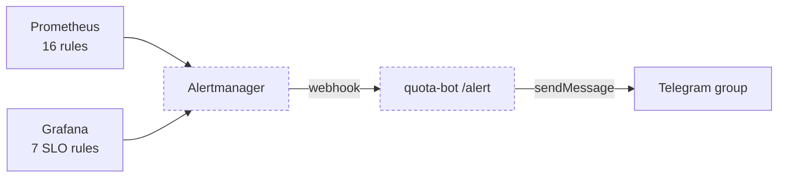

# Metrics build plan

Working document for the metrics architecture build. The analysis that produced
it lives in two published artifacts:

- **A100 Telemetry Spine** — current state, eight findings
- **Four Telemetry Backbones** — the four candidate architectures

This file is the execution order and the record of what was decided. Update it
as stages land.

## Decisions taken (2026-09-04)

| Question | Decision |
|---|---|
| Step 0 scope | Fix the langfuse-web bind **and** stand up Alertmanager wired to the bot |
| Coverage of the unmetered path | **Per-person keys behind the gateway.** Direct hostname stays as genuine break-glass |
| Access-log tailer for B | **Vector** — single binary, native ClickHouse sink, checkpointed file source |
| Boot sequencing | **Make services resilient**, not ordered. No systemd units; keep `restart: unless-stopped` and remove crash-on-boot hazards |

Build order is A → B → C → resilience → D. Each stage runs the same three
beats, in this order, and does not start the next until all three are done:

```
setup on host  ──▶  test  ──▶  bot integration
```

## Correction that changes the boot work

`docs/LANGFUSE.md` and the `otel-collector` comment block in
`docker-compose.langfuse.yml` both claim:

> SGLang raises on exporter INITIALISATION failure, so bringing the inference
> tier up without this overlay is not a supported combination.

**This is wrong for the collector-down case.** Verified 2026-09-04 against the
pinned engine image:

```
$ docker exec qwen36-27b-r0 python3 -c "... process_tracing_init('http://this-host-does-not-exist:4317', ...)"
RESULT: process_tracing_init SUCCEEDED against a dead endpoint  (0.01s)
```

`get_otlp_span_exporter` builds a `GRPCSpanExporter` with a lazy channel; no
connection is attempted until the first export. `process_tracing_init` raises
only on a genuinely malformed endpoint, an unsupported protocol, or a missing
`opentelemetry` package — not on an unreachable one.

Consequence: **replica startup does not depend on the collector.** The largest
suspected boot hazard is not real, which is most of why the resilience approach
is viable. Both docs were corrected in Stage 0 rather than deferred, since the
claim would have shaped every later decision.

## Stage 0 — restore and deliver ✅ DONE 2026-09-04

Nothing else is safe to build while failures are invisible.



**Setup**
1. `HOSTNAME: "0.0.0.0"` on `langfuse-web`; recreate. Inference tier untouched —
   the span path is asynchronous.
2. Alertmanager container on **`edge`**, webhook receiver only. Not the metrics
   backend: it must reach quota-bot, which is on `edge`/`higress-net`/
   `higressint`, and moving the bot to the backend instead would give an
   internet-reachable service a route to the worker ports.
3. `alerting:` block in `prometheus.yml`, hot-reloaded via `/-/reload`.

**Test — all passed**
- Collector queue drained 1000 → 0; `sent_spans` 2,272,818 → 2,290,440.
- ClickHouse `events_core` writing live again (+17,659 rows on the flush).
- `/alert` returns 401 without a bearer, 401 with a wrong one, 200 with the right one.
- End to end through the real Alertmanager: `notifications_total{webhook}` 4 → 8
  with `failed` frozen at 4 (all of them the pre-deployment 404s).
- Both directions delivered: FIRING for `PrometheusTargetDown` and
  `GpuMemoryPressure` (real rules, not synthetic), and RESOLVED for the smoke
  test at 09:45:18.
- Grouping behaved: two `GpuMemoryPressure` instances arrived as one message.

**Bot integration**
- `POST /alert` — Alertmanager webhook receiver, verifies a shared secret,
  enqueues, answers 200 immediately (same shape as the Telegram handler: nothing
  slow in the request path).
- Alert formatting with severity glyphs, grouped by alertname.
- `/alerts` — list what is currently firing.

## Stage A — aggregates ✅ DONE 2026-09-04

**Setup**
1. `redis_exporter` on `higressint`, `--check-keys 'chat_quota:*'`.
2. Prometheus job; recording rules for burn rate and days-to-empty.
3. `usage/` dashboard folder: balance, burn, tokens by consumer, error mix,
   share of node, top-N.
4. Alert: balance below one day of burn.

**Test — all passed**
- `redis_key_value` matches `./stats.sh` balances exactly, all four consumers.
- Alerts covered by `promtool test rules prometheus/rules_test.yml` instead of
  draining a live consumer — that would have broken a paying customer to test a
  warning, and could not exercise `QuotaLedgerUnreachable` at all. The tests
  caught two real bugs: funded-but-idle consumers silently dropping out of
  days-left, and `clamp_min` being passed a scalar.
- `/health`, `/usage`, `/balance` and `/balance <name>` all delivered through
  the real webhook; 13/13 targets, 0 alerts firing.

**Bot integration — done**
- `/usage` renders a bar per consumer beside the numbers.
- `/balance <name>` shows burn rate and runway; `/balance` gains a days column.
  Both read the recording rules, so bot, dashboard and alert cannot disagree.
- `/health` — targets, alerts, ledger, span backlog, throughput, TTFT, KV pool,
  and a warning line per condition that is silently wrong.

**Also folded in:** F6 (apiserver job removed — no scoped credential is possible),
the permanently-firing `GpuMemoryPressure` rule removed, F7 (gateway status panel
repointed from the retired `:8080` listener to `:80`).

## Stage B — the fact table

**Setup**
1. Add `"consumer":"%REQ(X-MSE-CONSUMER)%"` to `accessLogFormat` in the
   `higress-config` configmap. Configmap change → `./apply.sh --restart`.
2. Bound the access log: rotation, since it is unrotated today.
3. Vector container: file source (checkpointed) → ClickHouse sink, disk buffer
   so a ClickHouse outage queues rather than drops.
4. Dedicated ClickHouse database with an explicit TTL — **not** in Langfuse's
   `default`, given that instance's history of unbounded growth.
5. Per-person keys: issue one consumer per teammate, migrate OpenCode configs
   onto the gateway hostname.

**Test**
- Row count matches gateway request count for a window.
- Token sums reconcile against the Redis ledger.
- Kill ClickHouse for two minutes; confirm Vector buffers and replays with no
  gap and no duplicates.

**Bot integration**
- `/top [range]` — top consumers by tokens, requests, errors.
- `/p95 [consumer]` — real percentiles, now that per-request rows exist.
- `/errors` — error mix per consumer.

## Stage C — identity in traces

**Setup**
1. Envoy OTLP tracer in `higress-config` mesh config → existing collector.
2. Consumer and `chat_id` as span attributes; sampling policy.

**Test**
- Spans in Langfuse carry consumer; per-user views populate.
- Confirm the router still drops trace context, so gateway and engine spans stay
  separate traces joined on `request_id` — expected, not a regression.

**Bot integration**
- `/trace <request_id>` — deep link into Langfuse.

## Stage R — resilience, then a manual reboot test

No systemd units. The work is removing reasons order matters.

**Audit and fix**
- Correct the false SGLang claim in `docs/LANGFUSE.md` and the compose comment.
- Vector: disk buffer + checkpoint, so ClickHouse-down is a delay, not a loss.
- `redis_exporter`, Alertmanager: confirm they retry rather than exit.
- `langfuse-web`: converges on retry once deps are healthy — confirm no
  permanent-exit path.
- Confirm `edge` and `higressint` survive reboot (they are unowned externals).
- Confirm the GPU stack is ready before the replicas need it.

**Manual reboot test** — run by Danila. Full host restart, then verify every
service is up, every scrape target green, no data gap in the fact table, and no
alert left firing that should not be.

## Stage D — converged OTel

Only after A, B and C are proven and the reboot test passes. Scope decided then;
the argument against it today is a single silent failure domain across all three
signals, which is exactly what Stage 0 exists to fix.

## Rules that hold across every stage

- **Billing reads the ledger.** Prometheus counters reset; they never invoice.
- **No telemetry component in the request path.** ai-statistics is `FAIL_OPEN`
  deliberately; nothing added here may be able to stop inference.
- **Caddy must never reach a worker port or ZMQ socket.** This is the actual
  invariant; "nothing new joins `edge`" was a sloppy shorthand for it and Stage 0
  already had to break the shorthand. `edge` is where publicly-fronted and
  bot-adjacent services legitimately live (Caddy, router, Grafana, langfuse-web,
  quota-bot, and now Alertmanager). What must not happen is a service that is
  reachable from the internet gaining a route to `qwen36-27b-backend`.
- **The Caddyfile and the single-file mounts are inode-bound.** Edit in place;
  verify through the admin API, never the exit code.
- **Never disturb running inference.** Replica changes go one at a time through
  `deploy/roll-replica.sh`.
